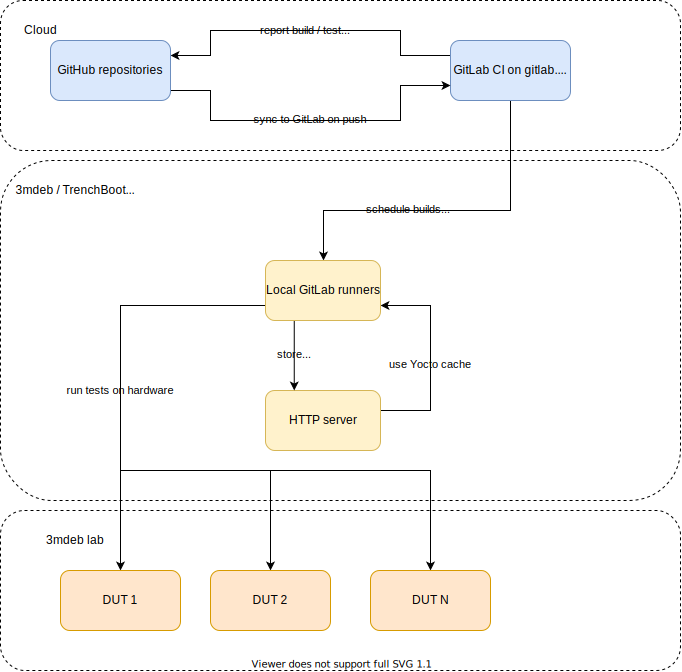

TrenchBoot CI infrastructure
============================

Infastructure
---

## Overview

The details of the supported Device Under Test (hardware platforms) can be
found in the
[testing-trenchboot repository](https://github.com/3mdeb/testing-trenchboot#supported-platforms).

## GitLab CI configuration

* [GitLab CI configuration](gitlab-ci/README.md)

## Local Gitlab Runners Configuration

* [Local GitLab Runners Configuration](gitlab-runner/README.md)

Pipelines
---

### Upstream

* [nixos-trenchboot-configs](https://gitlab.com/trenchboot1/3mdeb/nixos-trenchboot-configs/-/pipelines)
* [landing-zone](https://gitlab.com/trenchboot1/trenchboot/landing-zone/-/pipelines)
* [grub-tb](https://gitlab.com/trenchboot1/trenchboot/grub/-/pipelines)
* [linux-tb](https://gitlab.com/trenchboot1/trenchboot/linux/-/pipelines)
* [meta-trenchboot](https://gitlab.com/trenchboot1/3mdeb/meta-trenchboot/-/pipelines)

### Development

* [landing-zone](https://gitlab.com/trenchboot1/3mdeb/landing-zone/-/pipelines)
* [grub-tb](https://gitlab.com/trenchboot1/3mdeb/grub/-/pipelines)
* [linux-tb](https://gitlab.com/trenchboot1/3mdeb/linux/-/pipelines)

---

Job descriptions
---

* [nixos-trenchboot-configs](CI.md#nixos-trenchboot-configs)
* [landing-zone](CI.md#landing-zone)
* [grub-tb](CI.md#grub-tb)
* [linux-tb](CI.md#linux-tb)
* [meta-trenchboot](CI.md#meta-trenchboot)
